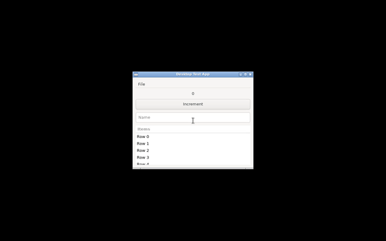

# OpenComputerUse

An open, self-hosted Computer Use MCP server — an alternative to proprietary computer use plugins. Provides 13 tools for inspecting and controlling desktop applications on macOS and Linux via the Model Context Protocol.

Works with Claude Desktop, Cursor, Codex, Hermes, and any MCP-compatible client.

This is an independent local implementation. It does not launch, wrap, proxy, import, or depend on any bundled native Computer Use plugin.

## What It Does

OpenComputerUse gives AI agents the ability to see and interact with desktop applications through accessibility APIs and screen capture. It supports:

- **Accessibility-first interaction** — targets UI elements by their accessibility tree metadata (role, name, index) rather than pixel coordinates alone
- **Visual element targeting** — natural language descriptions like "click the Save button" via `visual_click` and `visual_locate`
- **Multi-platform** — macOS (AppKit/Quartz), Linux X11 (AT-SPI2/xdotool), and a deterministic fake backend for testing
- **Safety controls** — audit logging, action budgets, rate limiting, and file-based emergency stop
- **Docker testing** — containerized Linux desktop with Xvfb, real GTK apps, and ffmpeg video recording

## Installation

### From source (developer, editable)

```bash
git clone <repo-url> && cd open-computer-use
python3 -m venv .venv
./.venv/bin/pip install -e .
open-computer-use-mcp --version
open-computer-use-mcp --self-test
```

### From source (user, non-editable)

```bash
pip install .
```

### Entrypoint

After installation, the `open-computer-use-mcp` command is available on `$PATH`. It launches the MCP server over stdio transport:

```json
{
  "mcpServers": {
    "open-computer-use": {
      "command": "open-computer-use-mcp"
    }
  }
}
```

### Requirements lockfile

For reproducible installs, use the lockfile:

```bash
pip install -r requirements-lock.txt
```

## Tools

| Tool | Description |
|------|-------------|
| `get_app_state` | Activate an app, capture a screenshot, and return an indexed accessibility tree |
| `list_apps` | List running desktop apps and optionally recently used or installed apps |
| `click` | Click an element by accessibility index or screenshot coordinates |
| `drag` | Drag from one coordinate to another |
| `press_key` | Press a key or key combination (e.g. `ctrl+c`, `Return`, `Tab`) |
| `type_text` | Type literal text into the active app |
| `scroll` | Scroll an element by index in a given direction |
| `set_value` | Set the value of an accessibility element |
| `perform_secondary_action` | Invoke an accessibility action (AXPress, AXShowMenu, etc.) |
| `analyze_screenshot` | Capture and analyze the screen with OCR and element detection |
| `screenshot_diff` | Compare two screenshots and report changed regions |
| `visual_click` | Click an element described in natural language |
| `visual_locate` | Find elements matching a natural language description without clicking |

## Safety Features

- **Audit log**: Structured JSONL log of all tool calls, arguments, and results (`OPEN_CU_AUDIT_LOG`)
- **Action budgets**: Limit total actions per session (`OPEN_CU_MAX_ACTIONS`)
- **Rate limiting**: Token-bucket rate limiter for actions per minute (`OPEN_CU_MAX_PER_MINUTE`)
- **Emergency stop**: Halt all actions by creating a file (`OPEN_CU_EMERGENCY_STOP_FILE`)
- **Clipboard preservation**: Clipboard contents are saved and restored around paste-based text input

## Backends

| Backend | `OPEN_CU_BACKEND` | Platform | Description |
|---------|-------------------|----------|-------------|
| macOS | `macos` | macOS | AppKit, Quartz, pyautogui |
| Linux X11 | `linux-x11` | Linux | Xvfb, xdotool, AT-SPI2 |
| Fake | `fake` | Any | Deterministic test backend |

Auto-detection: if `OPEN_CU_BACKEND` is unset, uses `macos` on macOS and `linux-x11` on Linux when `$DISPLAY` is set, otherwise `fake`.

## Quick Start

```bash
python3 -m venv .venv
./.venv/bin/pip install -r requirements.txt
./.venv/bin/python -m open_computer_use.server --self-test
./.venv/bin/python -m open_computer_use.server --list-tools
```

macOS users: grant Accessibility and Screen Recording permissions to the process that launches the MCP server (Terminal, VS Code, etc.).

## MCP Client Configuration

### Claude Desktop / Cursor

Add to your MCP config:

```json
{
  "mcpServers": {
    "open-computer-use": {
      "command": "./scripts/run_computer_use_mcp.sh",
      "cwd": "/path/to/open-computer-use"
    }
  }
}
```

### Codex Plugin

The `.codex-plugin/` directory contains the Codex plugin manifest. The MCP server config is in `.mcp.json`.

## Docker Testing with Video Recording

Run desktop tests in a containerized Linux environment with video capture:

```bash
./docker/desktop-test/run-and-record.sh
```

This builds a Docker image with Xvfb, ffmpeg, and a fixture GTK calculator app, then runs 9 smoke tests while recording the display. Video artifacts are saved to `test-recordings/`.

### Test Recording

The GIF below shows a real Docker run — Xvfb display, openbox window manager, and the GTK fixture calculator app being exercised by the 9 desktop smoke tests:



**What you're seeing:**
1. Xvfb virtual display starts at 1280x800 with openbox window manager
2. A GTK3 calculator fixture app launches (white window, top-left)
3. The 9 smoke tests run in sequence — `list_apps`, `get_app_state`, `click`, `type_text`, `press_key`, `scroll`, `set_value`, `drag`, `perform_secondary_action`
4. Each test interacts with the app via AT-SPI2 accessibility APIs and xdotool
5. The display flickers as tests click, type, and scroll through elements
6. All 9 tests pass in ~0.8 seconds

The MP4 source is also available at `test-recordings/desktop-test.mp4` (H264, 1280x800, 15fps, 4 seconds).

See [docs/TESTING.md](docs/TESTING.md) for details.

## Testing

```
236 tests across 12 test files — 227 pass locally (fake backend), 9 desktop smoke tests run in Docker

test_audit.py ..............    audit logging
test_clipboard.py ...........    clipboard preservation
test_coverage_gaps.py ......    edge cases and error paths
test_desktop_smoke.py ......    real GTK app interaction (Docker)
test_failure_modes.py ......    graceful degradation
test_linux_parity.py .......    macOS/Linux backend parity
test_mcp_contract.py .......    MCP JSON-RPC protocol
test_recording.py ..........    video recording infrastructure
test_safety.py .............    budgets, rate limiting, emergency stop
test_unit_coverage.py ......    backend internals
test_vision.py .............    screenshot analysis and OCR
test_visual_click.py .......    natural language element targeting
```

```bash
# Run locally (fake backend)
python3 -m pytest

# Run with Docker desktop tests
cd docker/desktop-test && docker compose run --rm desktop-tests

# Run with video recording
cd docker/desktop-test && docker compose run --rm desktop-tests-recorded
```

## Architecture

```
MCP Client (Claude, Cursor, Codex)
        │
        ▼
  server.py (JSON-RPC over stdio)
        │
        ▼
  TOOL_HANDLERS ──► safety.py (budget, rate limit, emergency stop)
        │
        ▼
  Backend (macOS / Linux X11 / Fake)
        │
        ├── capture_screenshot()
        ├── get_accessibility_tree()
        ├── click / drag / type_text / press_key / scroll
        └── audit.py (JSONL log)
```

See [docs/ARCHITECTURE.md](docs/ARCHITECTURE.md) for full details including the visual click pipeline and element caching strategy.

## Project Structure

```
open_computer_use/
  __init__.py          version and server identity
  server.py            MCP JSON-RPC server, tool dispatch
  tools.py             13 tool definitions and handlers
  backends/
    base.py            abstract Backend interface
    macos.py           macOS AppKit/Quartz backend
    linux_x11.py       Linux Xvfb/xdotool/AT-SPI2 backend
    fake.py            deterministic test backend
    input_utils.py     shared input helpers
  matcher.py           visual element matching (token-overlap scoring)
  vision.py            screenshot analysis, OCR, diff
  safety.py            action budgets, rate limiting, emergency stop
  audit.py             structured JSONL audit logging
  types.py             shared type definitions
docker/desktop-test/   containerized Linux test environment
tests/                 236 tests across 12 files
docs/                  architecture, testing, maturity roadmap, implementation plans
docs/plans/            implementation plans, bugfix docs, test plans
```

~6,150 lines of Python across the `open_computer_use` package and test suite.

## Documentation

- [Architecture](docs/ARCHITECTURE.md) — system design, data flow, visual click pipeline
- [Testing guide](docs/TESTING.md) — test tiers, commands, video artifacts
- [Docker test plan](docs/docker-desktop-test-plan.md) — containerized desktop test environment
- [Maturity roadmap](docs/maturity-roadmap.md) — project milestones and priorities
- [Implementation plans](docs/plans/) — phased build plans, bugfix docs, parity fixes

## Deployment

The MCP server can be deployed as a Docker container on any Linux host (x86_64 or ARM64).

### Quick Deploy

```bash
git clone <repo-url> && cd open-computer-use
docker compose -f docker/deploy/docker-compose.yml up -d
```

The MCP server will be available at `http://localhost:8080`.

- **Endpoints**: `/health` (GET), `/mcp` (POST — JSON-RPC), `/tools` (GET)
- **Transport**: HTTP/SSE via uvicorn (the stdio version runs locally; the container speaks HTTP)

### Docker Build Notes

A **Docker-specific requirements file** (`requirements-docker.txt`) is provided that excludes platform-specific packages (`evdev`, `pynput`) which require native display/input hardware unavailable inside a container. The remaining dependencies (`mss`, `pyautogui`, `pillow`, `numpy`, `pyperclip`, `pytesseract`, `fastapi`, `uvicorn`) are fully compatible with the containerized environment.

### Reverse Proxy (Optional)

To expose the container behind a reverse proxy (Traefik, Nginx, Caddy), override the compose file or add labels. For example, with Traefik:

```yaml
# docker-compose.override.yml
services:
  mcp:
    labels:
      - "traefik.enable=true"
      - "traefik.http.routers.open-computer-use-mcp.rule=Host(`your-domain.example.com`)"
      - "traefik.http.services.open-computer-use-mcp.loadbalancer.server.port=8080"
    networks:
      - proxy

networks:
  proxy:
    external: true
```

### Healthcheck

The container includes a built-in healthcheck (`/health` endpoint) to verify the MCP server is responding.

### Storage Management

Chromium accumulates cache, compiled JS, and component data (`~/.cache/chromium/`, `~/.config/chromium/`) that grows unbounded inside the container's overlay2 writable layer. Without intervention this consumes host disk over time.

Two mechanisms prevent this:

**1. tmpfs mounts (docker-compose.yml)**

The deployment compose file (`docker/deploy/docker-compose.yml`) mounts three directories as RAM-backed tmpfs with size caps:

| Mount | Size Cap | Contents |
|-------|----------|----------|
| `/home/testuser/.cache` | 300M | Chromium HTTP/media cache |
| `/home/testuser/.config/chromium` | 200M | Chromium profile, components (Widevine, TTS) |
| `/tmp` | 100M | Xvfb sockets, dbus, ATSPI runtime |

All data lives in RAM — zero disk growth, auto-cleaned on container restart. Total capped at ~600MB.

**2. Chromium launch flags (linux_x11.py)**

The Linux X11 backend adds cache-busting flags when launching Chromium:

- `--disk-cache-size=0` — no HTTP cache
- `--media-cache-size=0` — no media cache
- `--disable-gpu-cache` — no GPU shader cache
- `--incognito` — no profile/history persistence
- `--no-default-browser-check` — skip first-run prompt
- `--disable-background-networking` — no update pings

These flags prevent Chromium from writing caches even if the tmpfs mounts are removed. The tmpfs mounts are a belt-and-suspenders safety net.

## License

MIT
